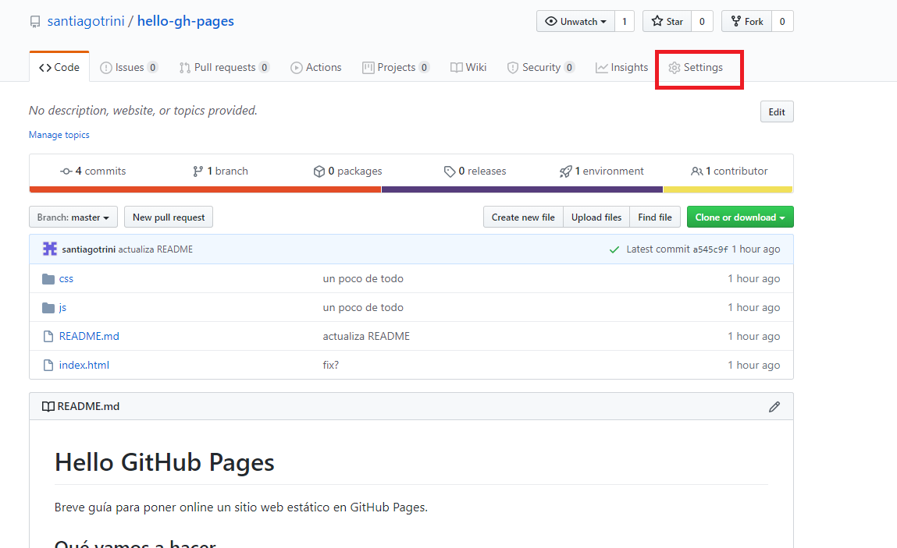
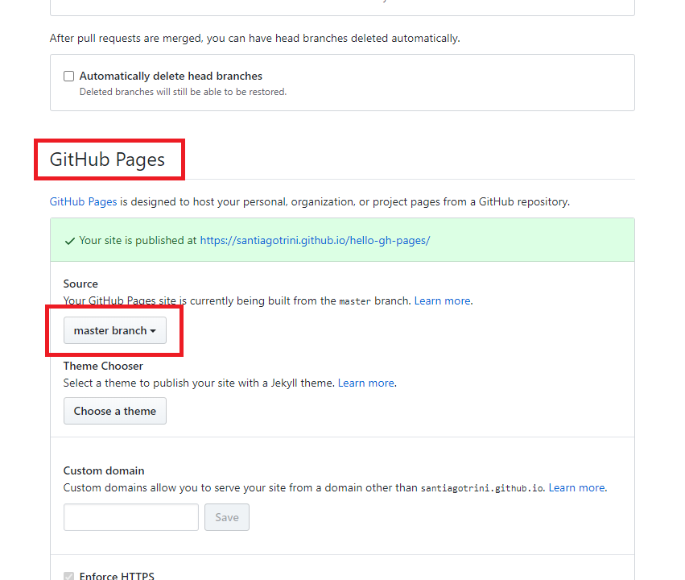

# Hello GitHub Pages

Breve guía para poner online un sitio web estático en GitHub Pages.

## Qué vamos a hacer

Una aplicación muy modesta, un conversor de temperaturas. Vamos a usar un poco de HTML, CSS y JS. Algunas cosas como crear un repo en GitHub están explicadas en el README de https://github.com/santiagotrini/express-hello-world.

## Crear el repo

Primero que nada creamos una carpeta y la convertimos en repo de Git. Agregamos un archivo `index.html`.

```
$ mkdir hello-gh-pages
$ cd hello-gh-pages
$ git init
$ touch index.html
```  

## Agregamos código a index.html

Creamos la interfaz de usuario con el siguiente código en el `index.html`. HTML es el lenguaje que usamos para definir los elementos y estructura de una página web. Y por supuesto para escribir el texto que contienen esos elementos como párrafos (`p`) y encabezados (`h1`) entre muchos otros elementos disponibles.

```html
<!DOCTYPE html>
<html lang="es" dir="ltr">
  <head>
    <meta charset="utf-8">
    <title>Conversor de temperaturas</title>
    <link rel="stylesheet" href="css/style.css">
    <link rel="stylesheet" href="https://cdnjs.cloudflare.com/ajax/libs/font-awesome/4.7.0/css/font-awesome.min.css">
  </head>
  <body>
    <h1>Conversor de temperaturas</h1>
    <p>Ingrese la temperatura en grados Celsius</p>
    <hr>
    <input id="tc" type="text" name="" value="0">
    <button type="button" name="button" onclick="convert()">Convertir</button>
    <p>En grados Fahrenheit: <span id="tf">32</span> ºF</p>
    <p>En Kelvin: <span id="tk">273.15</span> K</p>
    <hr>
    <a href="https://github.com/santiagotrini/hello-gh-pages">
      <i class="fa fa-github"></i>
    </a>
  </body>
  <script src="js/script.js" type="text/javascript"></script>
</html>

```

## Agregamos JavaScript para realizar la conversión

Creamos una carpeta `js` y un archivo dentro de la carpeta para el código.

```
$ mkdir js
$ cd js
$ touch script.js
```
Agregamos el siguiente código. Esto es un ejemplo de _scripting_ del lado del cliente. O sea código de JavaScript que se ejecuta en el navegador. Podemos cambiar elementos de la página al clickear un botón y otras cosas similares.

```js
// script.js

function convert() {
  let celsius = parseFloat(document.getElementById('tc').value);
  let fahrenheit = ((celsius * (9/5)) + 32).toFixed(2);
  let kelvin = (celsius + 273.15).toFixed(2);
  document.getElementById('tk').innerHTML = kelvin;
  document.getElementById('tf').innerHTML = fahrenheit;
}
```

Probamos que ande todo bien abriendo `index.html` en el navegador web. Ahora solo falta agregarle un poco de diseño con CSS y ya estaría listo para ponerlo online.

## Un poco de estilo

Creamos un archivo de estilos para nuestra app.

```
$ mkdir css
$ cd css
$ touch styles.css
```

En `style.css` copiamos el siguiente código o mejor aún, se inventan un estilo ustedes. No hay soluciones malas y buenas, sino bonitas y feas. CSS es el lenguaje que usa la web para definir los estilos de los elementos HTML que aparecen en una página web. Muy en resumen, se seleccionan los elementos con distintos selectores (`h1`, `p`) y se le aplican distintos estilos con pares de claves y valores como `color: white;`.

```css
h1, p {
  color: white;
  font-family: sans-serif;
}

h1 {
  font-size: 4em;
}

input {
  padding: 15px;
}

p, button, input {
  font-size: 2em;
}

body {
  background-color: #1D2021;
  text-align: center;
}

hr {
  width: 1000px;
}

a, i {
  font-size: 4em;
  color: white;
  margin: 20px;
}

button {
  background: #7b39cc;
  color: white;
  padding: 15px;
  border: 0px;
  border-radius: 5px;
  -moz-border-radius: 5px;
  -webkit-border-radius: 5px;
  margin: 20px;
}

button:active {
  background: #5e28a1;
  -webkit-box-shadow: inset 0px 0px 5px #451c78;
     -moz-box-shadow: inset 0px 0px 5px #451c78;
          box-shadow: inset 0px 0px 5px #451c78;
   outline: none;
}
```

## Commit, push y deploy

Tenemos la web lista, primero commiteamos en Git y después pusheamos a GitHub (se arman un repo a donde pushear).

```
$ git add .
$ git commit -m "primer commit"
$ git remote add origin https://github.com/usuario/hello-gh-pages.git
$ git push -u origin master
```

Para hacer el deploy nos vamos a nuestro repo en GitHub a la pestaña de configuración (_settings_) y buscamos GitHub Pages.



Elegimos publicar desde la rama `master`.



Listo, el sitio está disponible en https://santiagotrini.github.io/hello-gh-pages. A veces no funciona a la primera. La verdad no sé por qué, pero siempre que tengan el `<!DOCTYPE html>` en la primera línea de su `index.html` (que se tiene que llamar sí o sí `index.html`) debería andar todo. Si a la primera no anda agreguen un espacio en algún lado donde no haga daño y vuelvan a commitear y pushear, eso me funcionó a mí.

Cada vez que pusheamos código a nuestro repo los cambios se reflejan en el sitio.
Felicitaciones 🎉🎉👍, ya se pueden armar un blog o página personal.
Si se quedaron con ganas de más GitHub Pages sepan que este servicio está pensado para integrarse perfectamente con Jekyll, un generador de sitios estáticos.
Está muy bueno Jekyll si quieren hacerse un blog personal donde postear sus proyectos.
Más info en https://help.github.com/es/github/working-with-github-pages y en la web oficial de Jekyll https://jekyllrb.com/.
